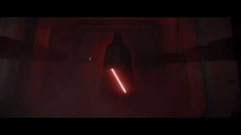

  

  

### Cybersecurity & Computer Science Student

*Breaking systems to understand how to defend them.*

 

## 🛡️ About Me

* 🎓 Studying **Computer Science**
* 🔐 Graduate of **Cyber Security**
* 🚩 Focused on **penetration testing, web security, OSINT, incident response and DFIR**
* 🧪 Building practical security projects and documenting hands-on labs
* 📚 Continuously improving through CTFs, TryHackMe rooms and security research

## 🧰 Technologies & Tools

  

`Nmap` · `Burp Suite` · `Wireshark` · `Metasploit` · `OSINT` · `Web Security` · `DFIR` · `IAM`

### `M4y Th3 F0rc3 B3 W1th Y0U.`

## 📊 GitHub Statistics

  

    

  

  

