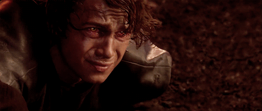

  

  

Cybersecurity & Computer Science Student
Breaking systems to understand how to defend them.

  

 

🛡️ About Me

🎓 Studying Computer Science

🔐 Graduate of Cyber Security

🚩 Focused on penetration testing, web security, OSINT, incident response and DFIR

🧪 Building practical security projects and documenting hands-on labs

📚 Continuously improving through CTFs, TryHackMe rooms and security research

🧰 Technologies & Tools

  

Nmap · Burp Suite · Wireshark · Metasploit · OSINT · Web Security · DFIR · IAM

M4y Th3 F0rc3 B3 W1th Y0U.

 

